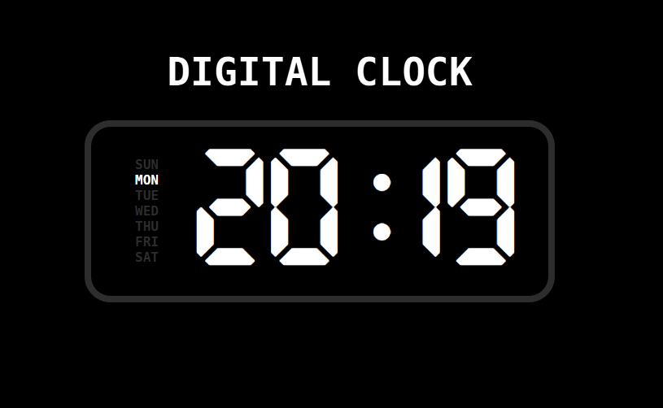

# Digital Clock

Um relógio digital moderno e responsivo, com dias da semana destacados e um efeito de texto animado. Projeto desenvolvido com HTML, CSS e JavaScript.



eu tava sem ideia do que fazer hj, decidi fazer um relogio pq nunca tinha feito um kkkk

## Como usar

1. **Clone o repositório**:

```
   git clone https://github.com/Numbzin/digital-clock.git
```

2. **Abra o projeto**:

   - Navegue até a pasta do projeto:

   ```
     cd digital-clock
   ```

   - Abra o arquivo `index.html` no seu navegador.

3. **Personalize**:
   - Altere o texto do título no arquivo `index.html`.
   - Modifique as cores e estilos no arquivo `css/style.css`.
   - Ajuste a animação do texto no arquivo `css/style.css`.

---

## Tecnologias utilizadas

- **HTML**: Estrutura do projeto.
- **CSS**: Estilização e animações.
- **JavaScript**: Lógica do relógio e interatividade.
- **Fontes Personalizadas**:
  - Digital.otf: Fonte do relógio digital.
  - Hack-Bold.ttf: Fonte dos dias da semana.

---

## Funcionalidades

- **Relógio Digital**:
  - Exibe horas e minutos em tempo real.
  - Dois pontos piscam a cada 500ms.
- **Dias da Semana**:
  - Dias são exibidos em uma coluna vertical.
  - O dia atual é destacado automaticamente.
- **Texto Animado**:
  - Efeito de gradiente animado no título.

---

## Licença

Este projeto está licenciado sob a licença MIT. Veja o arquivo LICENSE para mais detalhes.

## Contribuição

Contribuições são bem-vindas! Siga os passos abaixo:

1. Faça um fork do projeto.
2. Crie uma branch para sua feature (git checkout -b feature/nova-feature).
3. Commit suas mudanças (git commit -m 'Adicionando nova feature').
4. Push para a branch (git push origin feature/nova-feature).
5. Abra um Pull Request.
